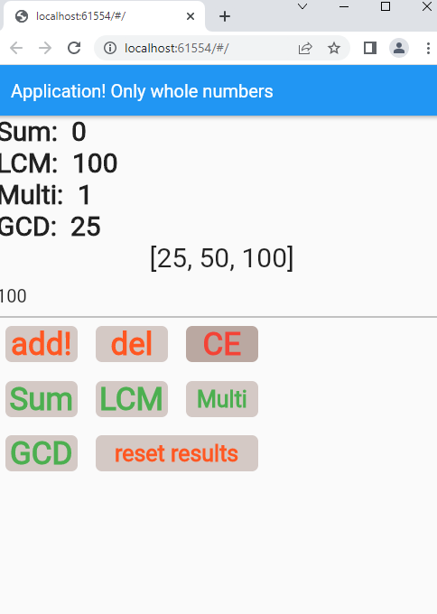

# FlutterCalculator

Calculator I made around year 2020 using the Flutter. That calculates 'Greatest common divisor', 'Least Common Multiple', 'Sum' and 'Multiple'.

[go to full screen shot](https://github.com/kristaps-m/FlutterCalculator/blob/main/screen_shots/calc1.png)

## Getting Started

This project is a starting point for a Flutter application.

A few resources to get you started if this is your first Flutter project:

- [Lab: Write your first Flutter app](https://flutter.dev/docs/get-started/codelab)
- [Cookbook: Useful Flutter samples](https://flutter.dev/docs/cookbook)

For help getting started with Flutter, view our
[online documentation](https://flutter.dev/docs), which offers tutorials,
samples, guidance on mobile development, and a full API reference.
